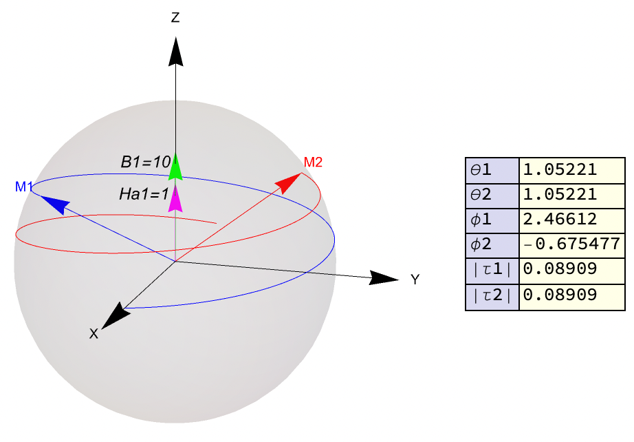
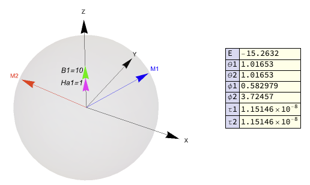
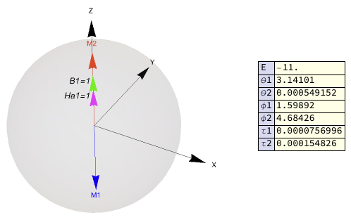
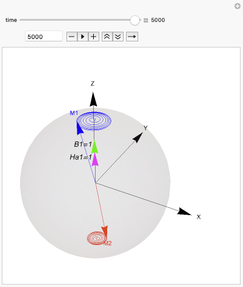

# AFMVisualize
A Mathematica Paclet that allows for visualization of two-sublattice antiferromagnetic dynamics with arbitary input, including Easy-axis anisotropy fields, hard-axis anisotropy fields, Zeeman fields, spin torques (time-dependent or indepedent Field-like torques and Antidamping-like torques).
The usual workflow is as
* Set up the system's magnetic params
* Find equilibirum position of the magnetization (ground state)
* Solve and visualize the eigenmodes (resonance mode)
* Visualize the antiferromagnetic dynamcis with designed driving fields (e.g. SOT)

## Installation

Download and put the ```AFMVisualize.wl``` file in the following path
```
Mathematica\Contents\AddOns\ExtracPackages
```
or somewhere your Mathematica could find ($Path).

To load the package:
```
Needs["AFMVisualize`"]
```
The following command will reload the package (overwite the variables) every time being called

```Get["AFMVisualize`"] ```

which is equivalent with
```
<<"AFMVisualize`"
```
After the package is sucessfully loaded, type ```?AFMVisualize`* ``` to see all variables and available functions.

## Examples

The files ```Examples.nb``` contains serveral basic instance regarding how to use this package.

See the **Convention** section at the end of this page for how the parameters are defined.

For the explanation of each available function, see the **Functions** section (next section).

The following steps will walk through the contents in the ```Example.nb``` files.

* Load the package and print all available functions
  
  ```
  Get["AFMVisualize`"] 
  ?AFMVisualize`*
  ```

* Add one easy axis along $z$ with amplitude=1 and one Zeenman field along $z$ with amplitude=10.
  Set the AFM exhcange strength to be 10.
  ```
  AddBFieldDC[10, {0, 0, 1}]
  AddEasyAxis[1, {0, 0, 1}]
  SetExchange[10]
  ```

* Display the current system's set up

  ```
  DispConfg[]
  ```
  This should return a Graphics3D plot and a table containing your input fields.

  

  The table can be turned off (figures alone) by ```DispConfg[]```.

* Note that the Zeeman field is large enough to render the syetem into spin flop phase.

  To have a sense of the spin flop phase, we can envolve the system with $m_1=(1,0,0)$ and $m_2=(-1,0,0)$ with 10000 interations and 0.1 Gilbert damping. The time steps is set to 0.001, small enough to   obtain the converged results.
  
  ```
  EvolveToEq[0.1, 0.001, 10000, {1, 0, 0}, {-1, 0, 0}]
  ```
  

  The magnetizations eventally evolve to a position with $\theta=1.05221$. The norm of the torques can also be found in the right table, which is close to zero for an equilibrium state. 

* To find the energy minimum with initial guess $(\theta_1,\theta_2,\phi_1,\phi_2)=(\pi/2,\pi/2,0,\pi)$
  
  ```
  FindEnergyMinima[Pi/2, Pi/2, 0, Pi]
  ```

  Or we can try a diffrent initial guess $(\theta_1,\theta_2,\phi_1,\phi_2)=(0,\pi,0,\pi)$

  ```
  FindEnergyMinima[0, Pi, 0, Pi]
  ```

  Both should return the same minimum energy $E=-15.2632$ with $\theta_1=\theta_2=1.01653$.

  Note that since we hasn't added any in-plane anisotrpy to break the symmetry, we will get $\theta_1=\theta_2$ while the azimuthal angles could be arbitary as long as they differ by $\pi$, reflecting the rotation symmetry.

* To find the true ground state
* 
   ```
  FindGS[]
   ```
  

  Now we see that $\theta_1=\theta_2=1.01653$ is indeed the ground state with almost vanishing torque $|\tau|$ at the order of $10^{-8}$.

* We can now linearize the LLF equation in the local frames of $m_1$ and $m_2$ at equilibrium position and visualize the Eigenmode of spin flop phase

  ```
  PlotEigen[]
  ```
  
  


* To see the AFM resonance dynamcis, we first decrease the external zeeman field to 1

  ```
  ResetAll[]
  AddBFieldDC[1, {0, 0, 1}]
  AddEasyAxis[1, {0, 0, 1}]
  SetExchange[10]
  ```

* Now the ground state should be the AFM state with $\theta_1=\pi$ and $\theta_2=0$ or  $\theta_1=0$ and $\theta_2=\pi$.

  ```
  FindGS[]
  ```
  

  One can change the ```WorkingPrecsion``` and ```MaxIterations``` in the source code to make the numerical results closer to the ideal one.

* We can now add an in-plane AC harmonic Zeenman field that generates the field-like torque for AFMR

  ```
  \[Omega]r = N[1 + Sqrt[1*(2*10 + 1)]]*\[Gamma];
  FL[t_] := 0.1*{Cos[\[Omega]r*t], Sin[\[Omega]r*t], 0};
  DL[t_] := {0, 0, 0};
  
  AFMDynamics[0.01, 0.01, 5000, FL, DL, {0, 0, 1}, {0, 0, -1}]
  ```
  

## Functions

* ```ResetAll[]```
  
Clear the inputs and reset all the parameters to their default values. 
<br/><br/>

* ```SetExchange[J_]```

 Set the AFM exchange strength (arbitary unit, positive) $B_E=J$. 
 <br/><br/>

 * ``` AddEasyAxis[Amp_, Dir_]```

 Add one Easy axis to the system with magnitude $B_A$=```Amp```(>0) in the direction given by ```Dir```. The function will automatically normalize the ```Dir``` vector.
 <br/><br/>

 * ``` AddHardAxis[Amp_, Dir_]```

Add one Hard axis to the system with magnitude $B_H$=```Amp```(<0) in the direction given by ```Dir```. The function will automatically normalize the ```Dir``` vector.
<br/><br/>

 * ``` AddBFieldDC[Amp_, Dir_]```

Add one DC Zeeman field to the system with magnitude $B_0$=```Amp``` in the direction given by ```Dir```. The function will automatically normalize the ```Dir``` vector. For AC Zeeman field, it's treated as the driving force (see the Spin torque part).
<br/><br/>

 * ``` RemoveEasy[i_]```

Remove ```i```-th Easy axis.
<br/><br/>
  
 * ``` RemoveHard[i_]```

Remove ```i```-th Hard axis.
<br/><br/>

 * ``` RemoveBFieldDC[i_]```

Remove ```i```-th DC Zeeman field.
<br/><br/>

 * ``` DispConfig[]```

Display the system's current configuration in a unit sphere.
<br/><br/>

 * ``` DispM[S1_,S2_]``` and ``` DispM[theta1_,theta2_,phi1_,phi2_]```

Display the the two unitary magnetic moments with position specified by two vectors ```S1``` and ```S2``` or four angle variables ```theta1,theta2,phi1,phi2``` with ```theta``` for polar angle and ```phi``` for azmuthal angle.
<br/><br/>

 * ``` AFMEnergy[S1_,S2_]```

Returns the magentic enenrgy (arbitary unit, see convention part) when two magnetic moments are in the positions specified by the vectors ```S1``` and ```S2```.
<br/><br/>

* ```FindEnergyMinima[t1_, t2_, p1_, p2_, switch_:"on"]```

Find one energy minimum with initial guess for the position of two magnetic moment S1={Sin[t1]]*Cos[p1], Sin[t1]*Sin[p1], Cos[t1]}; S2={Sin[t2]*Cos[p2], Sin[t2]*Sin[p2], Cos[t2]}. If switch=="off", a five-component vector will be return, containing the ground state energy, and four angles for the two magnetic moments at the energy minimum point. If switch=="on" (default values), the function will return group the results into a table for better visualization.
<br/><br/>

* ```FindGS[switch_="on"]```

Find the lowest energy minimum state for the system's current setup.  When switch is turned on (default value), it will return a Graphics3D object, showing the ground state configuration.
When switch is turned off (for the input of other function), it will only returns a four-component vectors contains the angles of S1 and S2. This function will find the ground state with initial direction running over all the directions of easy axis and hard-axis planes (including Zeenman field). **It's the user's responsibility to check whether this is the true ground state by examing where the energy has reached the lowest energy point and whether the torque are vanishing (will be shown when switch is turned on).**
<br/><br/>

* ```EvloveToEq[G_, dt_:0.001, tmax_:5000, m1i_, m2i_] ```

Find the equilibirum position of the two sublattice magnetization by evolving the current system according to the LLG equation. The partial differential equations are solved with simplified mid-point (implicit) method. **It's the user's responsibility to check the stability and check whether the outcome is consistent with the results from ```FindEnergyMinima``` or ```FindGS``` function.** To have a fast convengence and relable result, a large Gilber damping ```G``` and small time step ```dt``` (default: 0.001) should be used. The magnetization will be evolved with ```tmax``` times (default: 5000) with initial position given by two three-component vectors ```m1i``` and ```m2i```. 
<br/><br/>

* ```PlotEigen[]```

 Plot the eigenmode (resonance mode) for the current system's setup. This function will first find the ground state of the system and then linearize the LLG equation without damping and driving fields around each subllattice magnetization's equilibrium position. It will return a ```manuplate``` plot that allows the user to finely tune the demonstration and visualize the magnetization dynamics.
<br/><br/>

 * ```AFMDynmaics[G_, dt_ ,tmax_, FL_, DL_, m1i, m2i]```

Visualize the AFM dynamics for the current system's setup with driving field designed by the user. The input are: Gilbert damping ```G```, time step ```dt```, maximum interation times ```tmax```, Field-like torques ```FL```, Antidamping-like torques ```DL```, initial position of the two sublattice magnetic moment ```m1i``` and ```m2i```. The input spin torques ```FL``` and ```DL``` should be a function that returns the spin polarization (three component vectors) at each time. It can be either a constant function or a time-dependent function defined by the user such as ```FL[t_]:={Cos[t],Sin[t],0}```. This function will return a ```Manipulate``` plot that allows to tune the evolution time (interation times) for visualizing the magnetization dynamics. The tunable range is [2, tmax] since the index in Mathematica starts with 1 and the first index is reserved for initial state. This function will first find the equilibrium state without the driving field and set it as the initial state for the evolution of magnetization dynamics according to LLG equation.

## Conventions

The angular gyromagnetic ratio is set to be $\gamma=0.176085963023$ THz*rad/T

This means it's better for the users to intepretate their the effective fields to be in the Telsa unit [T] such that the times scale is ps (picosecond).

For example, when the time step ```dt=0.01``` and the system has interation times ```tmax=1000```, with all fields in Telsa unit, this means that the system has evolved 0.01*1000 = 10 ps.

The energy functional for the AFM system we adopt in this package is

$E[m_1,m_2]= J m_1\cdot m_2 -K_a (m_1\cdot \hat{n}_a)^2 -K_a (m_2\cdot \hat{n}_a)^2 -K_h (m_1\cdot \hat{n}_h)^2 -K_h (m_2\cdot \hat{n}_h)^2 - H_0 (m_1+m_2)$

Note that we have adopt the convention that the magnetic moment is a dimensionaless and unitary vectors so all the parameters in the above equation has energy unit.

To simulate a system with magnetic moment $\hbar \gamma S$ with $S$ the quantum spin number, one can obtain the effective field in the unit of Tesla according to $H^{eff}_i=-\partial E/\gamma\hbar S\partial m_i$.

Therefore, we have the the following expressions for the effective fields of exchange interaction, anisotropy field and Zeeman field:

$B^{ex}_1 = -B_E m_2\ \ \ B^{ex}_2 = -B_E m_1\ \ \ B_E=J/\hbar \gamma S >0$

$B^{easy}_i = B_A*(m_i\cdot \hat{n}_a) \hat{n}_a,\ \ \ B_A=2K_a/\hbar\gamma S >0$

$B^{hard}_i = B_H*(m_i\cdot \hat{n}_h) \hat{n}_h,\ \ \ B_H=2K_h/\hbar\gamma S <0$

$B_0 = H_0/\hbar\gamma S$

## Update

* Version-1.0 2024/10/28 
